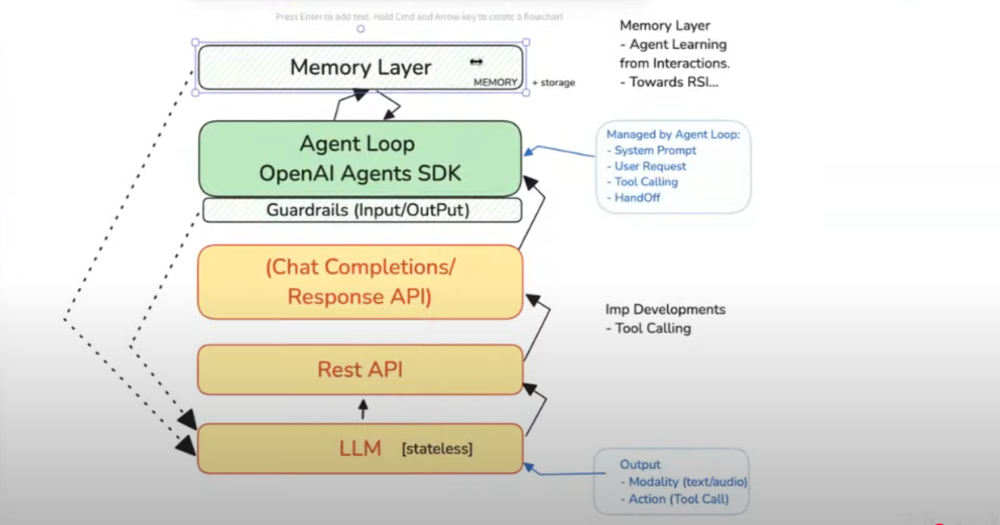

# Heading Level 1
## Heading Level 2
### Heading Level 3
#### Heading Level 4
##### Heading Level 5
###### Heading Level 6


Heading Level 1
======================

heading level 2
---------------

 

Normally Paragraph can be written this.
<!-- You have to pul a space here   -->
Normally Paragraph can be written this.
<p> This is a <br> normal paragraph </p>


**bold** This is best practice

<strong>also bold</strong>

__bold__

*italic* This is best practice

***Bold with Italic*** This is best practice

_italic with underscore_   This is not best practice

___bold with italic___ This is not best practice

> Hello, This is blockquote
>
> Pakistan Zindabad

> hello
>
> hello


>> Nested Blockquote

>>> More nested

>>>> More nested

* Bullet Points
    * You can go nested
        * you can go more nested

- Bullet Points with hypen
    - hello
        - hello

+ Bullet Point
    + Bullet point
        + bullet nest point


1. Ordered list item 1
2. Order list item 2
3. Order list item 3
    1. Nested
    2. nested item2
        1. More nested


<ol type='i'>
    <li>Hello</li>
</ol>


> ## This is heading
> - Unorder list
> * Unorder LIst
>
>  *italic*


<ol>
    <li>We can do like html<li>
</ol>


1. Item
    1. Nest Item
        1. More Nested


2) Hello *(Bad Practice)*
2. Hello *(Best Practice)*


* This is list item 1

   > this is paragraph


**Markdown**
```markdown

> this is blockquote
* bullet point
- bullet point
+ bullet point

1. Ordered list
    2. Nested order list


Link display with name
[Name to display](url)

[Mustafa Tawab](https://mustafatawab.vercel.app)


Display Image  


Display Image  with hyperlink
[](hyperlink)


We define a reference link like this [Mustafa Tawab][1]

[1]: https://mustafatawab.vercel.app "Tooltip"

```


**HTML**
```html
    <html>
        <title>

        </title>
    </html>
```


**CSS**
```css
.div{
    display: flex;
    justify-content: space-between;
    align-items: center

}
```


**Javascript**
```javascript
let a = 6
let name = "hello"
```


**Typescript**
```typescript

let name: string = "John Doe"
document.getElementById("div")
```


**python**
```python
age: int = 10
marks: float = 98.9
print(age)
```


**Java**
```java
String name = "Mustafa Tawab"
system.out.print(name) 
```


Define variable is `` x: int = 90 ``

-------------------------
__________________________

***************


[Mustafa Tawab](https://mustafatawab.vercel.app)


[Mustafa Tawab](https://mustafatawab.vercel.app, "Mustafa Tawab Portfolio  ")


**Open AI Agent SDK Image**



**clickable**
[](openai_agent_sdk/openai-agent-sdk.png)


https://farsightsystems.vercel.app

<farsightsystems@gmail.com>

tawab05@gmail.com


We define a reference link like this [Mustafa Tawab][1] is the CEO of [Farsight Systems][2]

[1]: https://mustafatawab.vercel.app "Tooltip"
[2]: https://farsightsystems.vercel.app "Tooltip"


Escape Characters with back slash \
\*  \-  \******


 **table**
| s.no | name |
| -----| ----| 
| 1   | ali |
| 2   | jaml|  
| 3   | jaml|  
| 4   | jaml|  
| 5   | jaml|  

