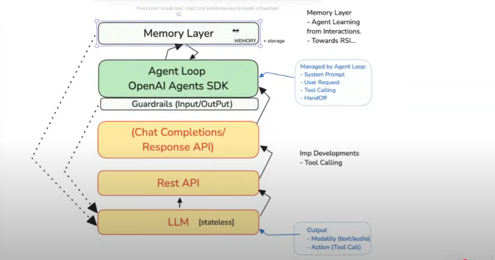

## Learn Python ##

* Agent is an LLM call
* Chat Completion API adopted by almost all companies
* Open AI announce Responsives API which is superset of Chat Completion API
* Tool Calling/Function Calling allows them to interact with external functions or tools to perform specific tasks.
* LLM is stateless. It does know what was my previous question

