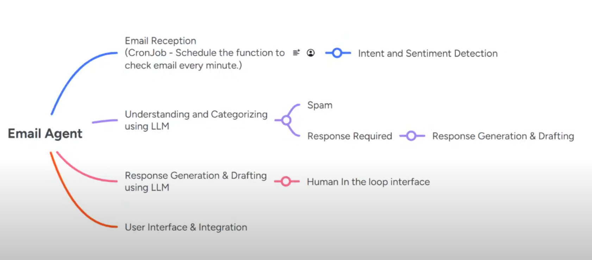

## Learn Agentic AI using ***OPENAI AGENT SDK*** ##


* Agent is an LLM call
* Chat Completion API adopted by almost all companies
* Open AI announce Responsives API which is superset of Chat Completion API
* Tool Calling/Function Calling allows them to interact with external functions or tools to perform specific tasks.
* LLM is stateless. It does not know what was my previous question


### System Prompt
* Give Instruction to the Agent. You have to send again and again with every answer
* Persona 


### User Prompt
* User want from the Agent to generate or do so work


## Email Agent Mindmap



<br>
<br>


Three Main Features of OpenAI Agent SDK
* **Agent Loop** 
* **Python First** 
* **Handoffs**: Delegate task between agents
* **Guardrails**: Input and Output Validation and Check in parallel to your agent
* **Function Tools**: External Resources and tools like Web Search
* **Tracing**


We can send LLM **Plain Text** and Which **Tool Cal**
1. User Prompt 
    ```python
        await Runner.run(agent , "What is decorator in python")

        Runner.run_sync(agent , "What is decorator in python")

    ```
    **Streaming**
    ```python     
        from openai.types.responses import ResponseTextDeltaEvent
        
        result = Runner.run_streamed(agent , "What is decorator in python")
        async for event in result.stream_events():
            print(event)
            if event.type == 'raw_response_event' and isinstance(event.data, ResponseTextDeltaEvent):
                print(f"\n[DATA] {event.data.delta}") 
     ```
2. System Prompt (**Agent Persona** = How an agent will behave)
    ```python
    Agent(name='Instructor' , instructions='You are an instructor of python' , model='', tools=[get_weather])
    ```
3. Custom Tool Scheema
    ```python
    from agents import function_tool
    # We can use built in tools like WebSearch , FileSearch etc but you need OpenAI API Key

    @function_tool
    def get_weather(city: str) -> str:
        return f"Nice weather at {city}"

    # is_enabled=False then it will not be used by the Agent. Use case is like maintainance working
    @function_tool(is_enabled=False)
    def customTool(x:str)->str:
        return x
    ```
4. Final output

By Default the Agent SDK user gpt-4o when you set the OPENAI_API_KEY.

We can connect built-in tools mentioned in the [docs](https://openai.github.io/openai-agents-python/tools/) just with the openai key. 


### Context 
Instructions which we want to send to agent.
```python

from pydantic import BaseModel
class UserContext(BaseModel):
    name: str
    age: int
    university: str

Agent[UserContext](...)

user=UserContext(name='Mustafa' , age=25, university='UOL')

Runner.run_sync(agent , input='user message', context=user)
```


### Dynamic Instructions 
Instructions send dynamically. It is system prompt.
```python
from agents import RunContextWrapper

# First Must be Context and second Agent in the parameter
def dynamic_instructions(context: RunContextWrapper[UserContext], agent: Agent[UserContext])->str:
    return f"The user name is {context.context.name} and age is {context.context.age} enrolled in {context.context.university}"


Agent[UserContext](name="Triage Agent" , instructions=dynamic_instructions) 

```

### Cloning

```python
pirate_agent = Agent(
    name='Pirate',
    instructions='Write like a pirate',
    model='03-mini'
)


robot_agent = pirate_agent.clone(
    name="Robot",
    instructions='Write like a robot'
)  

# this will clone the previous agent and can override properties like here I override the name and instructions. And the model will the name as the pirate_agent

```

### Forcing Tool Use (settings & Tools configuration)
```python
from agents import ModelSettings
from agents.agent import StopAtTools

Agent(
    name='Haiku Agent',
    instructions="Always respond in haiku",
    tools=[get_weather],
    model_settings=ModelSettings(temperature=1, tool_choice="none", parallel_tool_use=False) # tool_choice=[none, required , auto]  
    reset_tool_choice=False, # Default True
    # tool_user_behavior='run_llm_again', # Default
    tool_user_behavior=StopAtTools(stop_at_tool_names=['get_support_details']),
)

Runner.run_sync(agent, "Your message" , max_turns=4)

```


### Handoffs

```python
from agents import Agent, handoff
from agents.extensions import handoff_filters

billing_agent = Agent(name='Billing Agent')
refund_agent = Agent(name='Refund Agent')

general_agent = Agent(
    name='General Agent',
    handoff=[
        handoff(
            agent=billing_agent, 
            tool_name_override="refund_order", 
            tool_description_override="Handles a refund request", 
            is_enabled=True, # this is also callable which means we can pass custom function 
            input_filter=handoff_filters.remove_all_tools # input_filters -> we can pass custom function
        ), 
        handoff(agent=refund_agent)
    ]
)

```
____


```python

class CurrentUser(BaseModel):
    is_logged_in: bool 

def can_customer_refund(local_context: RunContextWrapper[CurrentUser], agent: Agent[CurrentUser]) -> bool:
    print("Local context " , local_context)
    print("Agent  " , agent)
    if local_context.context and local_context.context.is_logged_in:
        return False
    return True

billing_agent = Agent(name='Billing Agent')

agent = Agent(
    name="General Agent",
    handoffs=[
        handoff(
            agent=billing_agent,
            is_enabled=can_customer_refund
        )
    ]
)

def main():
    current_user = CurrentUser(is_logged_in=True)

    run = await Runner.run(
        agent,
        """ I want to refund my order  """,
        context=current_user
    )

    print(run.final_output)
    print(run.last_agent.name)
    

```


____


### Costumization of Runner
```python
from agents.run import AgentRunner , set_default_agent_runner


class CustomRunner(AgentRunner):
    async def run(self, starting_agent, input, **kwargs):
        return await super().run(starting_agent, input, **kwargs)

set_default_agent_runner(CustomRunner())


```